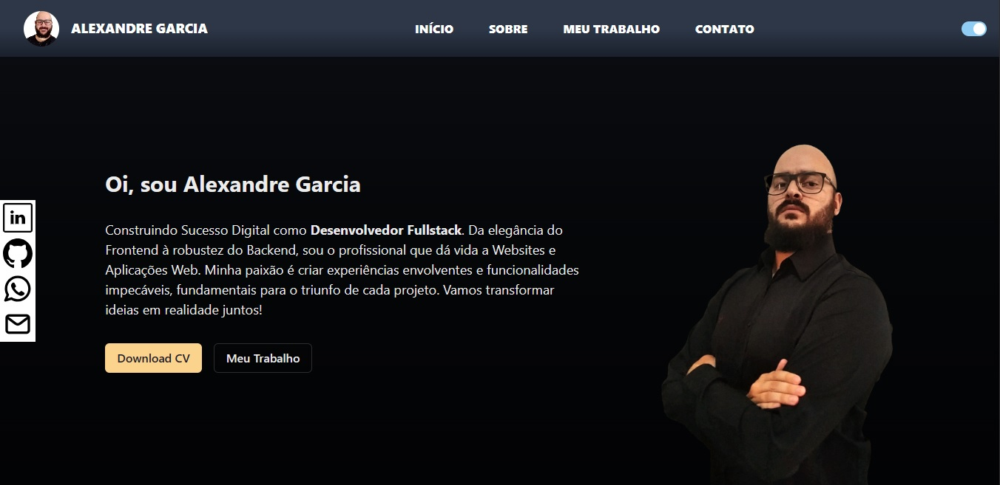

# Meu Portfólio

Bem-vindo ao meu portfólio! Esta é uma página web desenvolvida para mostrar minha jornada, habilidades, projetos e informações de contato. Foi construída utilizando ReactJS, TypeScript e Chakra UI para proporcionar uma experiência elegante e interativa.

## Acesso Rápido

- [Demonstração](#)
- [Visão Geral](#visão-geral)
- [Tecnologias Utilizadas](#tecnologias-utilizadas)
- [Como Executar Localmente](#como-executar-localmente)
- [Contato](#contato)

## Visão Geral

Esta aplicação é um portfólio pessoal que apresenta minha trajetória profissional, habilidades e projetos. É uma maneira de compartilhar minhas conquistas e me conectar com outras pessoas da área.

Principais recursos:

- **Apresentação de Projetos:** Explore detalhes dos projetos que trabalhei, incluindo descrição, tecnologias usadas e resultados obtidos.

- **Habilidades em Destaque:** Veja uma lista organizada das habilidades que possuo, abrangendo desenvolvimento front-end, back-end e mais.

- **Contato:** Você pode me contatar através das informações de contato fornecidas na aplicação.

## Tecnologias Utilizadas

- ReactJS
- TypeScript
- Chakra UI

Essas tecnologias foram escolhidas para criar uma aplicação moderna, escalável e visualmente atraente.

## Como Executar Localmente

1. Certifique-se de ter o Node.js e o npm instalados em sua máquina.

2. Clone este repositório:
   ```bash
   git clone https://github.com/AleexGarcia/portifolio